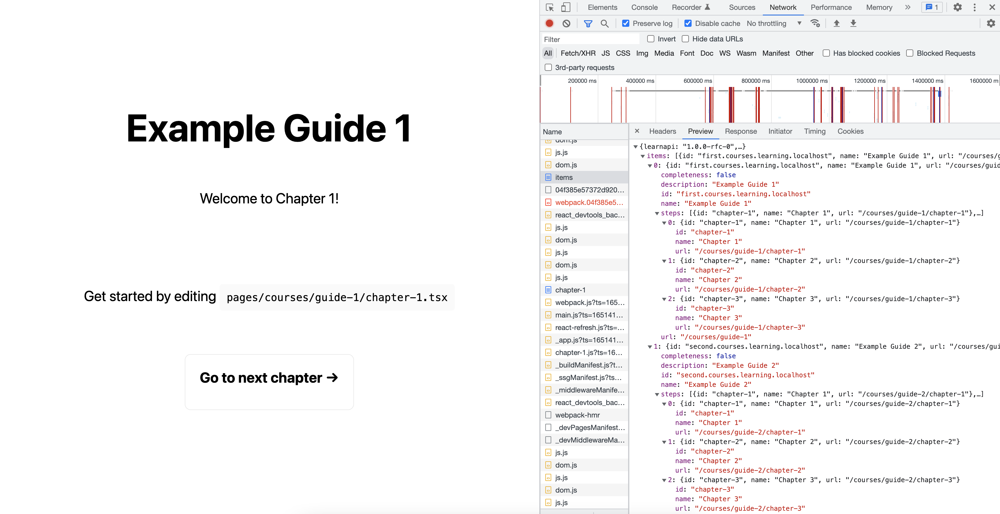

<h1 align="center">Next.js Learning Website with Learn API</h1>

This is a [Next.js](https://nextjs.org/) project template for learning websites with example implementation of [Learn API](https://github.com/orzechdev/learn-api). You can clone this repository to build learning website with it.



## Project description

Go to [learning-website.vercel.app](https://learning-website.vercel.app) to see example deployment:

- On [/courses](https://learning-website.vercel.app/courses) you can see all available courses within the website.
- On [/learnapi/items](https://learning-website.vercel.app/learnapi/items) you can see all data about available courses within the website, prepared according to [Learn API](https://github.com/orzechdev/learn-api).
- On [/learnapi/state](https://learning-website.vercel.app/learnapi/state) you can see progress state within particular courses for given user - you need to add uniqely generated user learning key to request headers as `Authorization: Bearer <learning-key>`, according to [Learn API](https://github.com/orzechdev/learn-api).

## Getting Started

### 1. Configuring user learning state persistance

The project is using Supabase to persist user learning state within PostgreSQL database. You can create and configure Supabase project on [Supabase website](https://supabase.com). Alternatively you can setup your own database on your own server.

The communication with database in both options is done in the project via Prisma.js library. You can learn more about it on [Prisma.js docs](https://www.prisma.io/docs/).

### 2. Configuring project

The project uses environment variables to securely persist configuration secrets like database configuration variables. You can setup them by creating `.env` file and filling it according to `.env.template`.

Before running project locally, you need to install project dependencies by executing the following commands from the project directory:

```bash
yarn install
# or
npm install
```

### 3. Develop

You can run the development server by executing the following commands from the project directory:

```bash
yarn dev
# or
npm run dev
```

Open [http://localhost:3000](http://localhost:3000) with your browser to see the result.

You can start editing the courses by modifying `pages/*` and `data/items.ts` accordingly. The pages auto-updates as you edit pages files. The endpoint `http://localhost:3000/learnapi/items` auto-updates as you edit data files.

To learn more of how to develop the website you can check out [Next.js tutorial](https://nextjs.org/learn).

### 4. Deployment

To preview the project on the web you can use Vercel by creating an project on [Vercel website](https://vercel.com/). After creating the project you will also need to add previously setup environment variables from `.env` also in Vercel dashboard accordingly.
